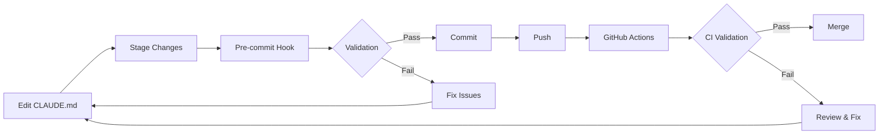

# CLAUDE.md Maintenance Automation

This document describes the automated CLAUDE.md validation and maintenance system implemented for this project.

## Overview

The CLAUDE.md file is critical for Claude Code's understanding of project context, commands, and conventions. To ensure it stays current and accurate, we've implemented a multi-layered automation system that validates CLAUDE.md consistency across multiple checkpoints.

## Components

### 1. Validation Script

**Location**: `scripts/validate-claude-md.js`

**Purpose**: Core validation logic that checks CLAUDE.md for:

- Required sections (Project Information, Commands, Features, etc.)
- Package name and CLI command references
- Script documentation completeness
- Outdated patterns (old version references)
- Node.js version alignment with package.json

**Usage**:

```bash
npm run validate:claude
# or directly:
node scripts/validate-claude-md.js
```

### 2. GitHub Actions Workflow

**Location**: `.github/workflows/claude-md-validation.yml`

**Triggers**:

- Push to main/master/develop branches
- Pull requests to main/master/develop branches
- Changes to CLAUDE.md, package.json, or validation scripts
- Manual workflow dispatch

**Checks**:

- ✅ Structure and required sections
- ✅ Package references accuracy
- ✅ Script documentation
- ✅ Prettier formatting
- ✅ No TODO markers
- ✅ Cross-validation with package.json

**View**: [GitHub Actions](../../actions/workflows/claude-md-validation.yml)

### 3. Pre-commit Hook

**Location**: `package.json` (lint-staged configuration)

**Behavior**: When CLAUDE.md is staged for commit:

1. Runs validation script to check consistency
2. Runs Prettier to ensure proper formatting
3. Blocks commit if validation fails

**Configuration**:

```json
"lint-staged": {
  "CLAUDE.md": [
    "node scripts/validate-claude-md.js",
    "prettier --write"
  ]
}
```

### 4. Integration with Quality Checks

**Location**: `package.json` scripts

**Integration Points**:

- `npm run validate:claude` - Manual validation
- `npm run validate:all` - Includes CLAUDE.md in comprehensive validation
- Pre-commit hooks via Husky + lint-staged

## Validation Rules

### Required Sections

The following sections MUST be present in CLAUDE.md:

1. **Project Information** - Package name, CLI command, purpose
2. **Project-Specific Commands** - npm scripts for linting, formatting, etc.
3. **Development Workflow** - Setup, prepare, and development commands
4. **Quality Automation Features** - ESLint, Prettier, Stylelint, Husky, etc.
5. **Development Notes** - Important context for development

### Package Reference Checks

- ✅ Package name from package.json mentioned
- ✅ CLI command (if exists) documented
- ✅ Critical npm scripts documented (lint, format, test, setup)

### Pattern Detection

Outdated patterns that trigger warnings:

- ❌ References to ESLint 8 (should be ESLint 9)
- ❌ References to Husky 8 (should be Husky 9)
- ❌ Outdated Node.js version formats
- ❌ TODO/FIXME markers

## Workflow

### Development Workflow



### Manual Validation

For manual checks or CI integration:

```bash
# Validate CLAUDE.md only
npm run validate:claude

# Comprehensive validation (includes CLAUDE.md)
npm run validate:all

# Pre-release validation (includes everything)
npm run prerelease
```

## Maintenance

### When to Update CLAUDE.md

Update CLAUDE.md whenever:

1. **Package metadata changes**: Name, version, CLI command
2. **New npm scripts added**: Especially critical workflows
3. **Dependencies upgraded**: ESLint, Husky, Node.js versions
4. **Project structure changes**: New directories, workflows
5. **Development practices change**: New conventions, patterns

### Keeping Validation Current

The validation script should be updated when:

1. **New required sections identified**: Add to `REQUIRED_SECTIONS`
2. **New outdated patterns emerge**: Add to `OUTDATED_PATTERNS`
3. **New critical scripts**: Add to `criticalScripts` array
4. **Validation rules evolve**: Update check functions

### Best Practices

1. **Always validate before committing**: Let pre-commit hooks catch issues
2. **Review warnings**: Even non-blocking warnings indicate maintenance needs
3. **Keep sections updated**: Don't let documentation drift from reality
4. **Remove TODO markers**: Resolve them before committing
5. **Test after package.json changes**: Ensure references stay accurate

## Troubleshooting

### Validation Fails on Commit

```bash
# See what failed
npm run validate:claude

# Common issues:
# 1. Missing sections - Add required sections to CLAUDE.md
# 2. Package name mismatch - Update references in CLAUDE.md
# 3. TODO markers - Resolve or remove TODOs
# 4. Formatting - Run: prettier --write CLAUDE.md
```

### GitHub Actions Failing

1. Check workflow runs in Actions tab
2. Review validation errors in job logs
3. Fix locally and test with `npm run validate:claude`
4. Commit and push fixes

### Pre-commit Hook Not Running

```bash
# Reinstall Husky hooks
npm run prepare

# Verify hook exists
ls -la .husky/pre-commit

# Test lint-staged
npx lint-staged
```

## Implementation Checklist

When setting up this automation in a new project:

- [ ] Copy `scripts/validate-claude-md.js`
- [ ] Copy `.github/workflows/claude-md-validation.yml`
- [ ] Add `validate:claude` script to package.json
- [ ] Add CLAUDE.md to lint-staged configuration
- [ ] Update `validate:all` to include `validate:claude`
- [ ] Test locally: `npm run validate:claude`
- [ ] Test pre-commit: Stage CLAUDE.md and commit
- [ ] Verify GitHub Actions runs on push

## Future Enhancements

Potential improvements to consider:

1. **Auto-fixing**: Automatically update some references from package.json
2. **Version sync**: Auto-update version references when package.json changes
3. **Link checking**: Validate internal and external links
4. **Schema validation**: JSON Schema for CLAUDE.md structure
5. **Diff analysis**: Suggest updates based on package.json changes
6. **Integration tests**: Ensure CLAUDE.md matches actual project state

## Related Documentation

- [RELEASE_CHECKLIST.md](RELEASE_CHECKLIST.md) - Pre-release validation steps
- [Quality Workflow](.github/workflows/quality.yml) - General quality checks
- [Main CLAUDE.md](../../CLAUDE.md) - The file being validated

## Support

For issues or questions about CLAUDE.md automation:

1. Check validation output for specific errors
2. Review this documentation
3. Test with `npm run validate:claude`
4. Check GitHub Actions logs
5. Open an issue if automation has bugs
